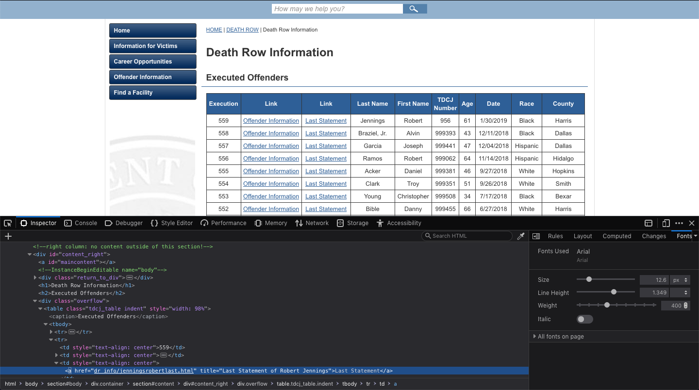
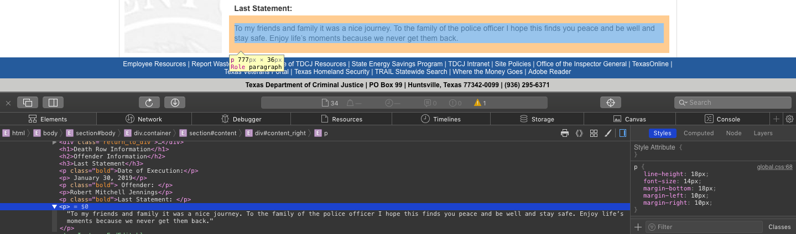
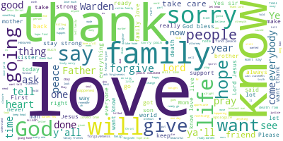

Recently I started going through Harvard's [CS109 class](http://cs109.github.io/2015/), which aims to be a practical and broad intro to data science (using python). I'm enjoying it a lot, and it has definitely given me a push to do something with python (finally!).

A few months ago, I was intrigued by the beautiful SQL lessons at [SELECT \* SQL](https://selectstarsql.com)—mainly because of the excellent content, but also because of the intriguing data set. The data set deals with last statements of prisoners on death row. It is definitely a controversial topic, but I think an interesting one that can only spark productive discussion. What is really interesting is that such data _exists_ and is _publicly accessible._

For the little project, I decided to scrape the data and do some type of short analysis that could be impactful. I ended up doing a word cloud of the statements (inspiration was [Goodbye, Warden](http://www.goodbyewarden.com/), data is [here](https://www.tdcj.texas.gov/death_row/dr_executed_offenders.html) and is the same as for SELECT \* SQL). So, lets start.

# The Process

Import the relevant modules.

```python
    # module for http requests
    import requests
    # module for handling markup objects
    from bs4 import BeautifulSoup
    # visualization module
    import matplotlib
    import matplotlib.pyplot as plt
    # print out graphics in the document
    %matplotlib inline
    # module that implements word clouds
    from wordcloud import WordCloud
```

Get the site with the links to all the prisoner information. To get a manageable version, apply BeautifulSoup to the original results. The prettify function can be used to get a more human-readable version of the text.

```python
    main_pg_txt = requests.get("https://www.tdcj.texas.gov/death_row/dr_executed_offenders.html").text
    # main_pg_txt
    main_pg_html = BeautifulSoup(main_pg_txt)
    # main_pg_html.prettify()
    # main_pg_html
```

Now it's time to figure out how to access the last statements. Here the crucial tools is the dev tools in the browser (element inspector in particular). I was expecting the "Last Statement" to have some type of class or id, but unfortunately it didn't have, so I had to find a common structure and use that instead.



Using the bs4's function find_all, we can find all links which contain the wanted text.

```python
    # find all links with text "Last Statement"
    links = main_pg_html.find_all('a', href=True, text="Last Statement")
    # len(links)
    # links
```

Now it's easy to get all the href's inside the link tags. Two of the links were of different extensions compared to the others so I manually changed them. Then I defined the urls I'm going to use as the base url concatenated with the extracted links.

```python
    # get the urls
    urls = [link['href'] for link in links]
    # urls
    urls[13] = 'dr_info/cardenasrubenlast.html'
    urls[14] = 'dr_info/pruettrobertlast.html'
    # urls
    whole_urls = ['https://www.tdcj.texas.gov/death_row/' + url for url in urls]
    # whole_urls
```

Once again, the structure of the pages with the statements wasn't unified so I had to find a pattern and apply it like this (most of the times, it ended up being the 5th paragraph).



I then defined a function which goes through an array of urls, for each url processes it, gets the statement and appends it to an array.

```python
    def get_last_statements(urls):
        statements = []
        for url in urls:
            site = requests.get(url).text
            html = BeautifulSoup(site)
            ps = html.find_all('p')
            if len(ps) >= 6:
                statement = ps[5].getText()
            statements.append(statement)
        return statements
```

Assign the statements array with our array of links.

```python
    last_statements = get_last_statements(whole_urls)
    # last_statements
```

Join all the statements into one string separated by blanks:

```python
    combined = " ".join(statement for statement in last_statements)
    # combined
```

Make a word cloud using the Wordcloud function (from the module of the same name) and save to a png file.

```python
    wordcloud = WordCloud(max_font_size=100, max_words=200, background_color="white").generate(combined)

    # Display the generated image:
    plt.imshow(wordcloud, interpolation='bilinear')
    plt.axis("off")
    plt.show()
    # save to png file
    wordcloud.to_file('last_statements.png')
```

# The Result



# Summary

This was a very short exercise in python and web scraping. Definitely, a lot more can be done and a more rigorous approach can be taken. For now it was a good start with immediate results, and maybe some day I'll get back to the data in the future with more ideas. The general approach was:

1. Starting point: an origin site with a bunch of links
2. Find a way to get all the urls to the separate sites (use dev tools inspector)
3. Get all the urls and store them in an array
4. Investigate again with element inspector how to get a particular statement from separate site
5. Define a function that for each url, grabs a particular statement and stores it in an array
6. Combine all the statements into a single string and input it into the wordcloud function
